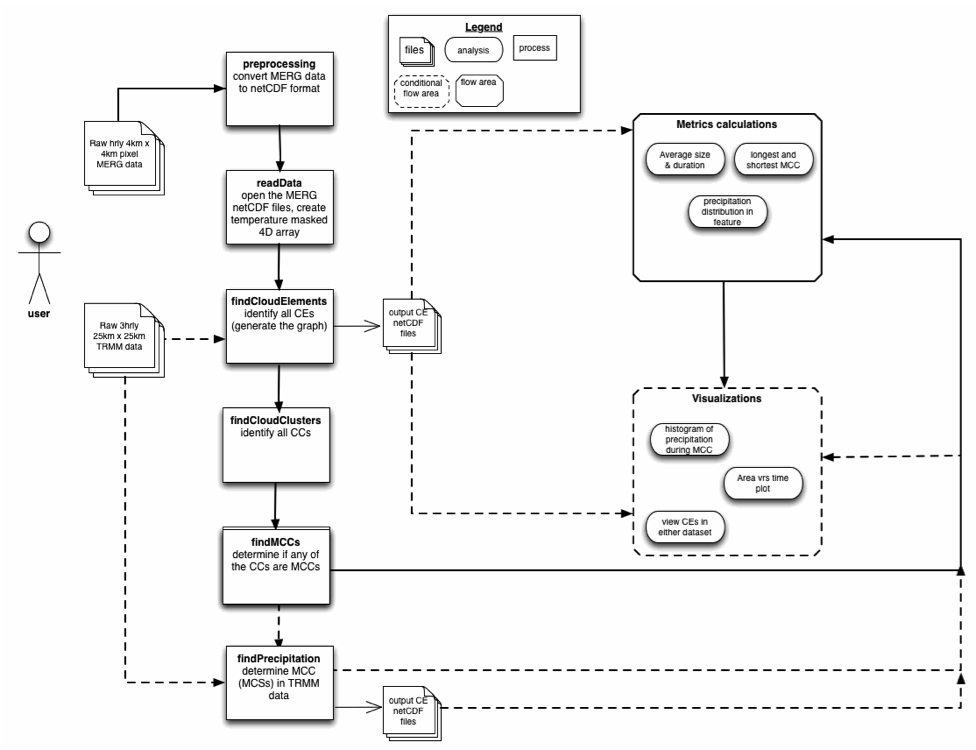

#Graph-based Search for the Identification and Chatacterization of Mesoscale Convective Complexes

##Very Brief Introduction
If you are in this file it means that you wish to use the mccSearch.py program, or learn more about it. 

##What is this project about?
This program searches for a weather feature known as a Mesoscale Convective Complex (MCC) in gridded infrared and precipitation rate satellite data (MERG and TRMM datasets have been tested). 
The data is read from netCDF files into arrays with the dimensions time, latitude, longitude, value. 

##What is needed?
 * Python 2.7.4 (We used Anaconda 1.5.1 64 bit libraries, which installed most of the dependencies.) Other module dependences: 
 * Nio - https://www.pyngl.ucar.edu/Nio.shtml
 * netCDF - http://www.unidata.ucar.edu/software/netcdf/
 * sciPy - http://www.scipy.org/scipylib/index.html
 * NumPy - http://www.scipy.org/scipylib/download.html
 * Networkx - https://networkx.github.io/download.html
 * matplotlib - http://matplotlib.org/downloads.html
 * GrADS (We used OpenGrADS grads2 Version 2.0.1.oga.1) - http://sourceforge.net/projects/opengrads/files/
 * LATS4D - http://sourceforge.net/projects/opengrads/files/

##Download the source code and store in a folder
 * mccSearch.py contains all the function needed 
 * mccSearchUI.py contains a wizard type Q&A for running the program
 * process.py contains some needed functions (from older version of Apache OCW)
 * file.py contains some needed functions (from older version of Apache OCW)
 * mainProg.py contains a sample of the  general workflow of the order the modules should be called. There are three main inputs you will have to supply:
     * mainDirStr : this is the directory where you wish all the output files –images, textfiles, clipped netCDF files- to be stored
     * TRMMdirName : this is the directory where the original TRMM data in netCDF format is stored
     * CEoriDirName : this is the directory where the original MERG data in netCDF format is stored
 * Store the GrADsScripts folder (and contents) in a separate folder in the same main directory as the source code folder.  

##Download data in one folder (with only the data files)
This is a very crude program. The following assumptions are made:
 * input data are in one folder. For MERG data this is CEoriDirName and for the TRMM data this is TRMMdirName in mainProg.py.  These directories cannot be the same.
 * THERE IS NO FILE CHECKING. So please ensure ALL your files are there in netCDF format. 
 * THERE IS NO FILE ERROR HANDLING. Please ensure that the MERG data and the TRMM data files are correlated temporally and spatially

##Run mccSearchUI.py
As a first try to determine the workflow, run the mccSearchUI.py wizard. 

##Configure mainProg.py
Guidance on the workflow can be seen in the figure below. More details on individual functions in mccSearch.py can be found in the DocStrings. 

The general workflow of the program. The dashed lines indicate optional paths. 

##Run mainProg.py
Keep your fingers & toes crossed!! Once everything went well, the directory you indicated where outputs should be stored will be generated, and four folders should appear in it. 
 * The image folder will store all images generated from plots.
 * The textFiles folder will store all the text files generated during the run, e.g. cloudElementsUserFile.txt that contains information about each cloud element identified
 * The MERGnetcdfCEs folder contains the infrared data in clipped netCDF files that have been generated for each cloud element identified
 * The TRMMnetcdfCEs folder contains the precipitation data in clipped netCDF files that have been generated for each cloud element identified.

##Anticipated future work
 * Implement functionality for file checking to ensure all files are there
 * Create a user interface based on mainProg.py. 
 * Plug the project into the Regional Climate Model Evaluation Database (RCMED) that is available at Apache OCW. 
With increased usage, it is anticipated that more metrics and visualizations will be provided. 
